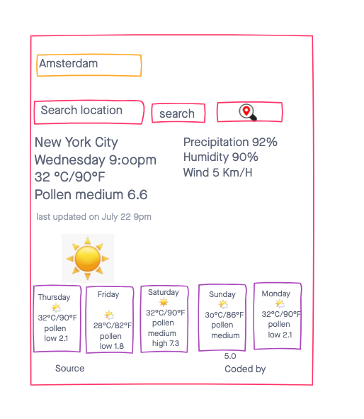

# project4
# Real time weather app
* Weather app that has real time updates

* Deployment: https://project4-xjsl.vercel.app/

# Api Used:
https://www.tomorrow.io/

# Technologies Used:
* React.js, Next.js

# Wireframe

# User Stories
* As a user I want to be able to check current weather for my area
* As a user I want to see real-time weather info and forecasting.
* As a a user I want to see hourly and weekly forecasting with interactive maps.
* As a user I want to see sunset and sunrise time.

# MVP
* Shows real-time weather info
* Extended 7 days forecast
* One-click Celcius to Fahrenheit conversion and vice versa
* Use Geo-location to find 

# Stretch Goals
* Work with tailwind or bootstrap top make website look best as possible
* Website for mobile use

# Sprints
* Day 1: Research as much as possible, play around with Api Data
* Day 2: Set up the page to fit all the data, 
* Day 3/4: Implement API to page to display data and finish MVP
* Day 5-7: Work with styling frameworks to make page look as nice as possible and also available for mobile use